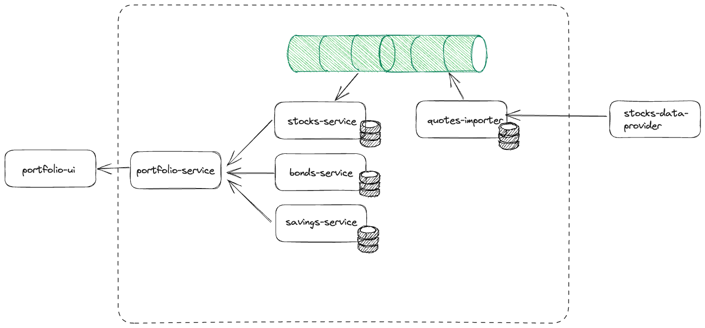

# Financial Portfolio

This system is under development and its main purpose is to serve as learning tool for different IT topics as Microservices, REST, React, Test Automation, and more. 

## Architecture



### Components Details

#### Portfolio Service

PORT: 8080

````shell
# Starting Application
./gradlew :portfolio-service:bootRun
curl http://localhost:8080/actuator/health
````

#### Stocks Service

PORT: 8081

````shell
# Starting Application
./gradlew :stocks-service:bootRun
curl http://localhost:8081/actuator/health
````

#### Docker

````shell
# Docker
docker-compose build # Build financial-portfolio images

docker-compose up financial-portfolio # Starting all services

docker-compose down -v # Stop environment

# Useful Commands
docker run -it --entrypoint /bin/sh -t financial-portfolio
````

## Test Strategy

This project contains different test approaches for learning purposes. They are:
1. **Unit Tests**: 
Each module has its own Unit Tests suite, and they are using Mockito as test doubles. The idea is to test small pieces of each module focusing the validation in specific part where it was developed. The unit tests are available in `component-folder\src\test\unit` for each component
2. **Integration Tests**: 
Tests that exercise each module of the SUT to ensure the module can communicate with each other. However, I'm using test doubles (Wiremock and In Memory database) since the real integration is going to be replaced by Contract Tests. The integration tests are available in `component-folder\src\test\integration`
   > ... in microservice architectures they are typically used to verify interactions between layers of integration code and the external components to which they are integrating
3. **Component Tests (or service tests)**: TO BE CREATED
4. **Contract Testing (Pact.IO)**: TO BE CREATED
5. **Postman**: In my opinion Postman is a great tool for testing APIs **manually**. It allows the creation of test suites and execution on a CI Tool, however, this is not the goal of this project, since there are other better options for it. Postman's files are available on `test-approaches/Postman`

## References

### Test Automation Concepts

- [IntegrationTest (Martin Fowler)](https://martinfowler.com/bliki/IntegrationTest.html)

- [Testing Strategies in a Microservice Architecture (Martin Fowler)](https://martinfowler.com/articles/microservice-testing/#testing-integration-introduction)

### Tools Reference

During the development of this "learning system" I needed to search for some help on the Internet. Here are the list of articles I think are more important. 

- JUnit 5: [JUnit 5 Parameterized Tests (baeldung)](https://www.baeldung.com/parameterized-tests-junit-5)

- RestAssured: 
  - [Rest Assured Usage](https://github.com/rest-assured/rest-assured/wiki/Usage)
  - [Testing RESTful Services in Java: Best Practices (Philipp Hauer's Blog)](https://phauer.com/2016/testing-restful-services-java-best-practices/)
- AssertJ: [AssertJ Core Assertions Guide](https://assertj.github.io/doc/#assertj-core-assertions-guide)

- Jenkins:
  - [Downloading and running Jenkins in Docker](https://www.jenkins.io/doc/book/installing/docker/)
  - [How to Build Your Custom Jenkins Docker Image (yallalabs.com)](https://yallalabs.com/devops/jenkins/how-to-build-custom-jenkins-docker-image/) 
  - [How to Deploy Jenkins using Docker Compose (yallalabs.com)](https://yallalabs.com/devops/how-to-deploy-jenkins-using-docker-compose/)

- Docker:
  - [Manage Docker as a non-root user](https://docs.docker.com/engine/install/linux-postinstall/#manage-docker-as-a-non-root-user)
  - [Run the Docker daemon as a non-root user (Rootless mode)](https://docs.docker.com/engine/security/rootless/)

- Spring: [Building REST services with Spring](https://spring.io/guides/tutorials/rest/)

### Useful Tools

- [JSON to JSON Schema](https://www.liquid-technologies.com/online-json-to-schema-converter)